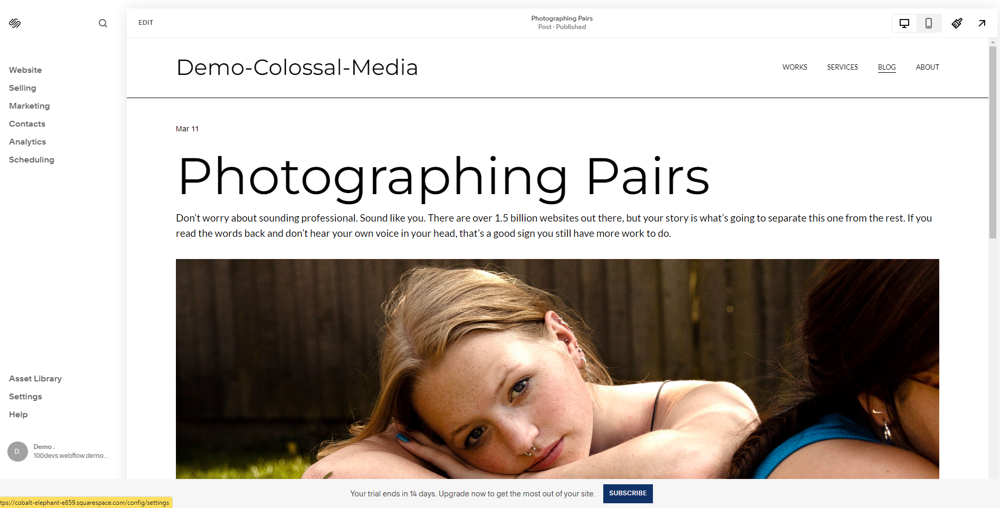
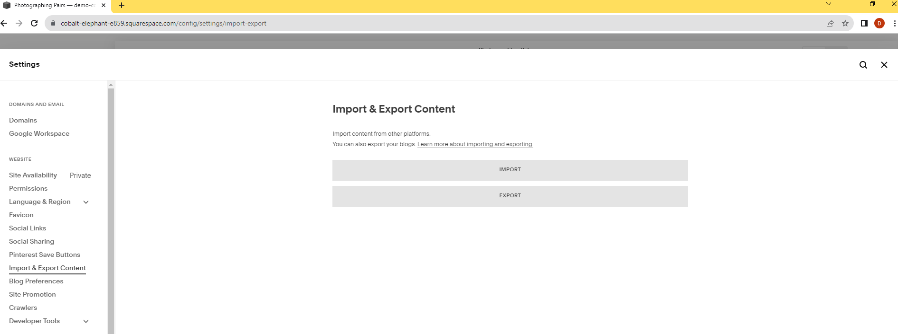
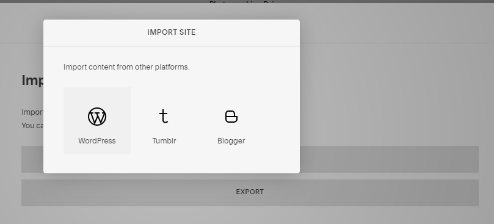
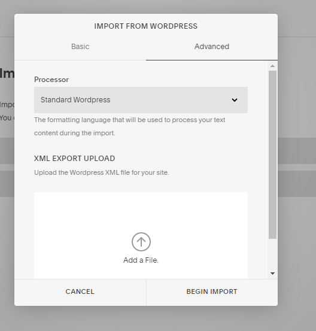
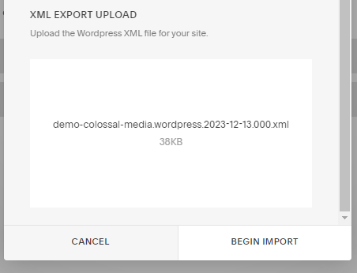
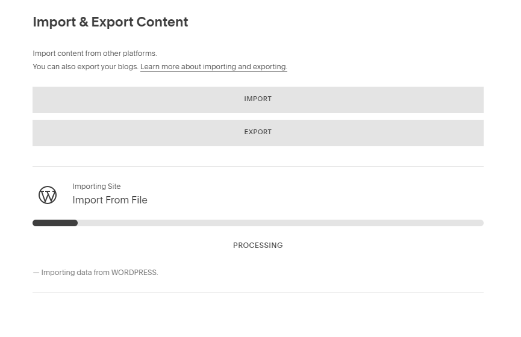
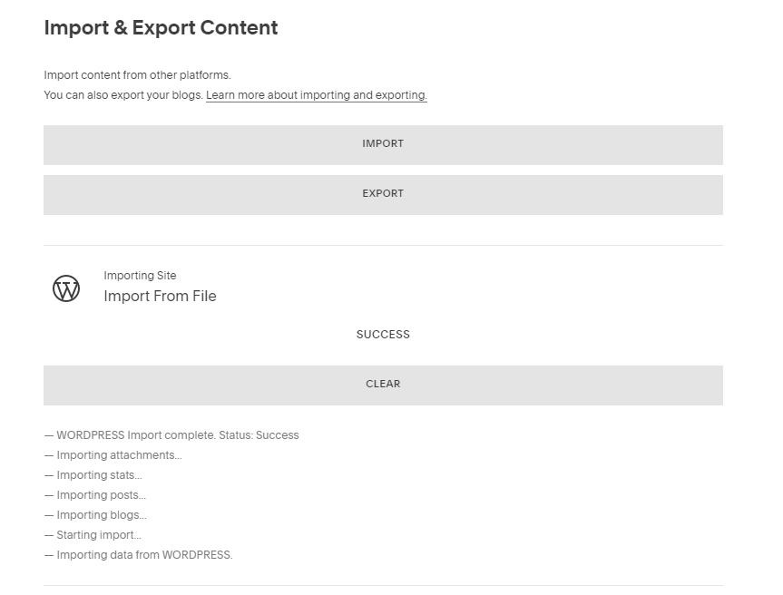

Advanced Small Scale Wordpress to Squarespace Migration

Demo Squarespace Site:
https://cobalt-elephant-e859.squarespace.com/

McCURRY is the Template similar to
https://www.globalstreetart.com/

McCURRY Template:
https://www.squarespace.com/templates/mccurry-fluid-demo

First Go to Settings on the left hand side:

Next go to Import  & Export on the left hand side

Click Import, then select WP

Select the Advanced tab and then Upload your XML Export

Testing small scale blog posts with demo-colossal-media.wordpress.2023-12-13.000.xml

Begin Import

It begins loading the file:

Then loads a success message:

