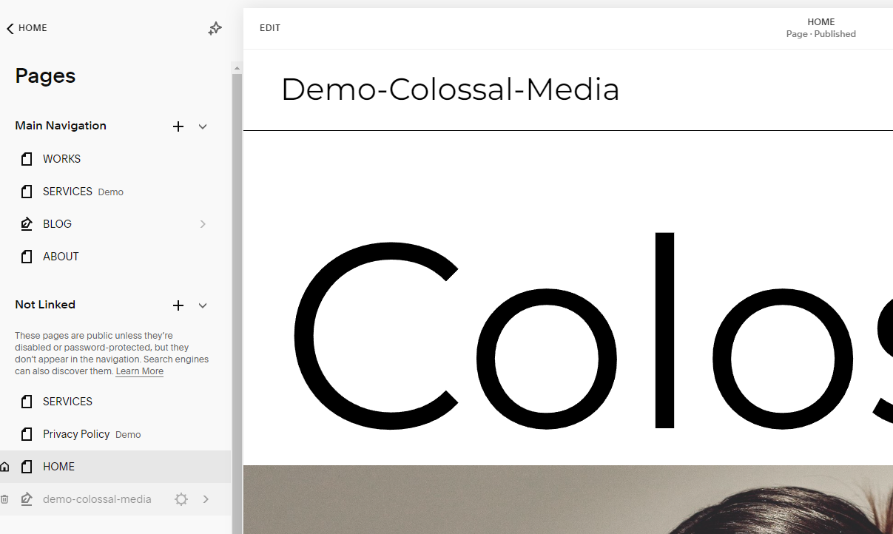
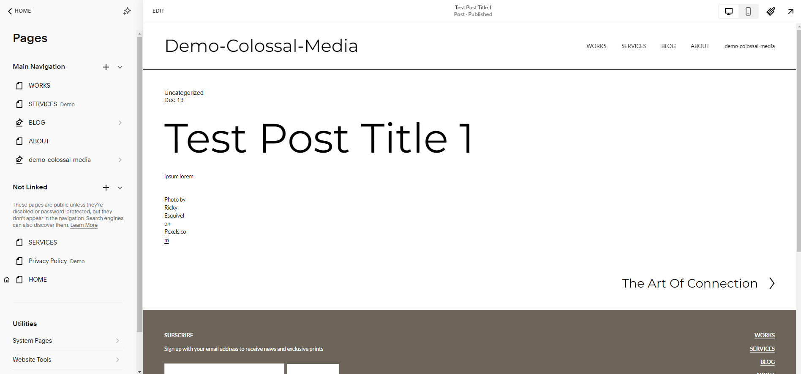
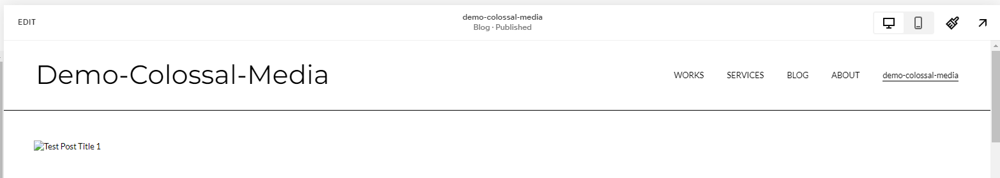

Advanced Small Scale Wordpress to Squarespace Migration

Demo Squarespace Site:
https://cobalt-elephant-e859.squarespace.com/

McCURRY is the Template similar to
https://www.globalstreetart.com/

McCURRY Template:
https://www.squarespace.com/templates/mccurry-fluid-demo

First Go to Settings on the left hand side:

Next go to Import  & Export on the left hand side

Click Import, then select WP

Select the Advanced tab and then Upload your XML Export

Testing small scale blog posts with demo-colossal-media.wordpress.2023-12-13.000.xml

Begin Import

It begins loading the file:

Then loads a success message:

The imported content will be in the Not linked section of the pages panel. You may need to refresh it to appear:

Be sure to select Enable page and Save the settings in the upper left corner of the modal

You can click and drag the Not Linked page up to the Main Navigation.

In this example the XML blog post imports are labelled 'demo-colossal-media'
This now appears on the navigation bar.

The 7 blog posts are now displayed on this new page. However the image reference appears to be broken.

