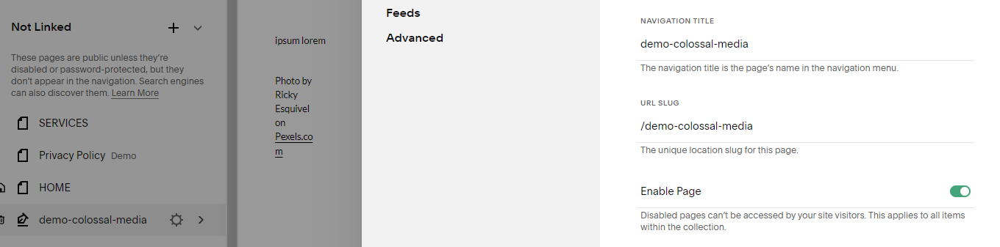

Advanced Small Scale Wordpress to Squarespace Migration

Demo Squarespace Site:
https://cobalt-elephant-e859.squarespace.com/

McCURRY is the Template similar to
https://www.globalstreetart.com/

McCURRY Template:
https://www.squarespace.com/templates/mccurry-fluid-demo

First Go to Settings on the left hand side:

Next go to Import  & Export on the left hand side

Click Import, then select WP

Select the Advanced tab and then Upload your XML Export

Testing small scale blog posts with demo-colossal-media.wordpress.2023-12-13.000.xml

Begin Import

It begins loading the file:

Then loads a success message:

The imported content will be in the Not linked section of the pages panel. You may need to refresh it to appear:

Be sure to select Enable page and Save the settings in the upper left corner of the modal

You can click and drag the Not Linked page up to the Main Navigation.

In this example the XML blog post imports are labelled 'demo-colossal-media'
This now appears on the navigation bar.

The 7 blog posts are now displayed on this new page. However the image reference appears to be broken.
This may be due to some limitations of imports:

Squarespace won't import other content, including:

Content from plugins
Gallery images
Image captions
Images saved in your Media Library but not attached to any posts or pages. We recommend downloading all images in your Media Library so you have them as a backup
Style or CSS. To customize your Squarespace site's design, use site styles.
Some information from WordPress will import but won't match with how it works in WordPress. For example:

Blog authors import as basic authors. To grant permissions to a basic author, invite them as a contributor, then remove them as a basic author and transfer authorship of their blog posts to their contributor account.
Tags and categories that are too long will be cut off. You can bulk-edit them so they fit these character limits: 80 characters for tags, 25 characters for categories.
Your content will import as one blog page.

This is the preview of the imported XML blog posts
https://cobalt-elephant-e859.squarespace.com/demo-colossal-media

Note that the URL slug is similar, however not exactly the same as the individual field note page.
https://colossalmedia.com/field-notes/citymeals-on-wheels
compared to
https://cobalt-elephant-e859.squarespace.com/demo-colossal-media/2023/12/13/test-post-title-1

On the archive pages the year and month slug is:
https://colossalmedia.com/field-notes/2023/11/
however compared to year, month, day
https://cobalt-elephant-e859.squarespace.com/demo-colossal-media/2023/12/13/test-post-title-1

We could potentiall change the URL slug from
'demo-colossal-media' to 'field-notes'

In conclusion, further testing would be needed to hash out migration, especially on a larger scale.

There may be interesting advanced features baked into Squarespace such as Post Blog Item Code Injection

Other areas to research would be refining URL slugs to match their current structure, 301 redirects (https://support.squarespace.com/hc/en-us/articles/205815308-URL-mappings?platform=v6&websiteId=657a2e9db316731dae6aaaec), and uploading large media.