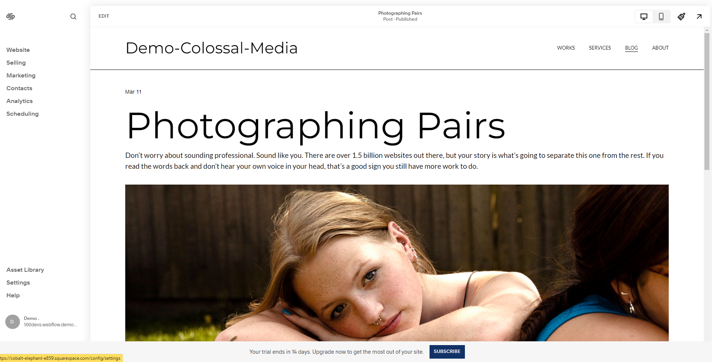
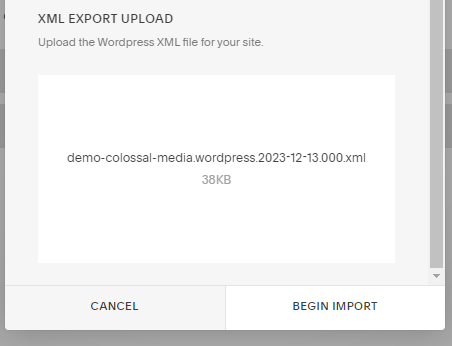
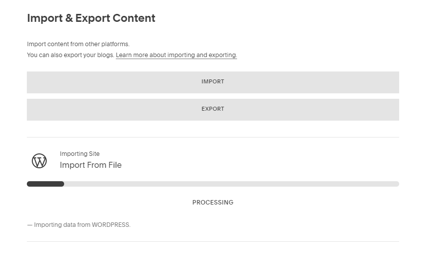
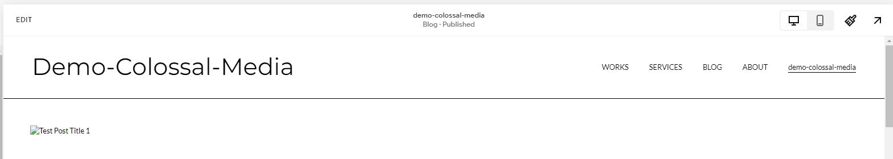

# Advanced Small Scale WordPress to Squarespace Migration

## Demo Squarespace Site
[https://cobalt-elephant-e859.squarespace.com/](https://cobalt-elephant-e859.squarespace.com/)

## MCCURRY Template
Similar to [Global Street Art](https://www.globalstreetart.com/), MCCURRY template can be found [here](https://www.squarespace.com/templates/mccurry-fluid-demo).

### Migration Steps

[Additional resource for WP to Squarespace Migration](Importing_Content_from_Wordpress)

1. **Access Settings:** Navigate to 'Settings' on the left-hand side.
   

2. **Import & Export:** Select 'Import & Export' from the left-hand menu.
   

3. **Initiate Import:** Click 'Import', then choose 'WP'.
   

4. **Upload XML Export:** Go to the 'Advanced' tab and upload your XML export file.
   

   Testing with file `demo-colossal-media.wordpress.2023-12-13.000.xml`.

5. **Start the Import Process:** Begin the import process.
   
   The system will start loading the file.
   
   Then, it displays a success message.
   

6. **Locate Imported Content:** The imported content appears in the 'Not linked' section of the pages panel. Refresh if necessary.
   

7. **Enable and Save the Page:** Enable the page and save settings in the modal's upper left corner.
   

8. **Adjust Navigation:** Drag the 'Not Linked' page to the 'Main Navigation'.
   

   The XML blog posts, labeled 'demo-colossal-media', will now appear in the navigation bar.
   

   The blog posts are displayed on the new page, but image references might be broken due to import limitations.

### Limitations and Considerations

- Squarespace does not import plugin content, gallery images, image captions, and unattached Media Library images. Custom styles and CSS are also not imported.
- Blog authors, tags, and categories might need adjustments post-import.
- Only one blog page will be imported.

### Preview of Imported Posts
[Demo Colossal Media on Squarespace](https://cobalt-elephant-e859.squarespace.com/demo-colossal-media)

### URL Structure Comparison
The URL slug could be changed from 'demo-colossal-media' to 'field-notes' to align with the current structure.

### Further Testing and Advanced Features
Further testing is needed for large-scale migration. Additional features to explore include Post Blog Item Code Injection and URL slug refinements.

[301 Redirects on Squarespace](https://support.squarespace.com/hc/en-us/articles/205815308-URL-mappings?platform=v6&websiteId=657a2e9db316731dae6aaaec) and media uploads are also areas for further research.